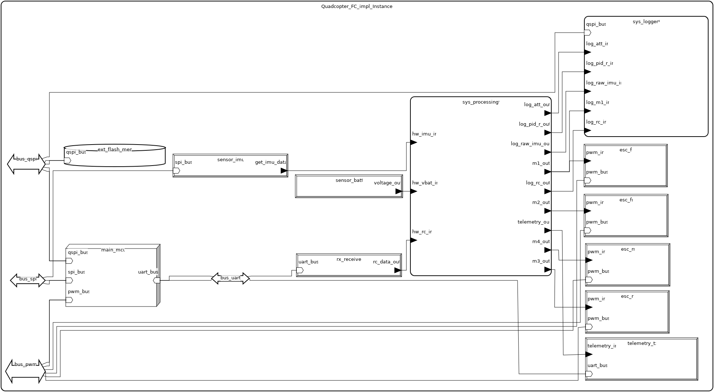
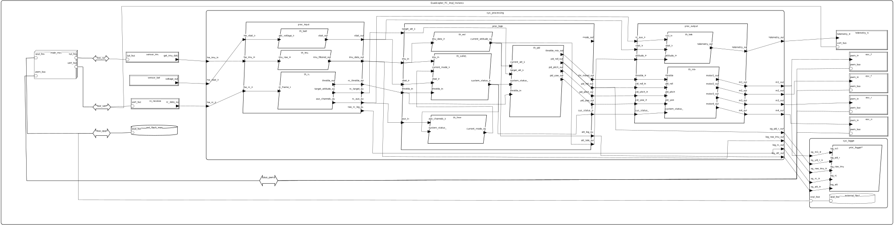

# Flight Control System – Model AADL (Kontroler lotu drona)

## Autor

**Imię i nazwisko:** Łukasz Bogacz
**E-mail:** lukaszbogacz@student.agh.edu.pl

---

## Opis modelowanego systemu

### Opis ogólny

Model przedstawia architekturę systemu sterowania lotem dla czterowirnikowego drona (quadcopter), zaprojektowaną w języku **AADL (Architecture Analysis & Design Language)**.  
System realizuje pełny proces sterowania lotem, który obejmuje:

- pozyskiwanie danych z czujników (IMU, napięcie baterii, odbiornik RC),
- estymację orientacji przestrzennej (roll, pitch, yaw),
- obliczanie sygnałów sterujących (PID),
- zarządzanie trybami lotu i bezpieczeństwem,
- sterowanie silnikami poprzez regulatory ESC,
- telemetrię,
- zapis danych do pamięci (blackbox).

Architektura została podzielona na **podsystemy funkcjonalne**, które zwiększają czytelność, modularność i możliwość analizy systemu.

---

### Opis dla użytkownika

Z punktu widzenia użytkownika (pilota drona) system:

- odbiera komendy z aparatury RC,
- stabilizuje drona automatycznie,
- umożliwia przełączanie trybów lotu,
- chroni przed sytuacjami niebezpiecznymi (np. niski poziom baterii),
- zapisuje dane lotu do późniejszej analizy,
- wysyła dane telemetryczne.

Dzięki temu dron jest stabilny, responsywny i bezpieczny w użytkowaniu.

---

## Spis komponentów AADL z komentarzem

### Typy danych (Data)

| Nazwa | Opis |
|--------|------|
| `imu_data` | Dane z czujnika IMU: przyspieszenia i prędkości kątowe |
| `sbus_frame` | Ramka danych z odbiornika RC (SBUS) |
| `attitude_data` | Orientacja drona: roll, pitch, yaw |
| `motor_command` | Wartości sterujące silnikami |
| `flight_mode_type` | Aktualny tryb lotu |
| `system_status` | Status systemu (uzbrojenie, napięcie baterii, tryb) |
| `telemetry_data` | Dane wysyłane przez telemetrię |

---

### Magistrale (Bus)

| Typ | Zastosowanie |
|------|--------------|
| `spi`  | Komunikacja z IMU |
| `uart` | Odbiornik RC i telemetria |
| `qspi` | Zewnętrzna pamięć Flash |
| `pwm`  | Sterowanie regulatorami ESC |

---

### Urządzenia (Devices)

| Nazwa | Funkcja |
|--------|--------|
| `IMU` | Czujnik inercyjny |
| `Receiver` | Odbiornik RC |
| `Battery_Sensor` | Czujnik napięcia baterii |
| `Telemetry_Transmitter` | Moduł telemetrii |
| `ESC` | Regulatory silników |

---

### Pamięć

| Nazwa | Opis |
|--------|------|
| `External_Flash` | Zewnętrzna pamięć QSPI do zapisu logów |

---

### Wątki (Threads)

| Nazwa | Rola w systemie |
|--------|-----------------|
| `IMU_Driver` | Filtruje dane z IMU |
| `RC_Handler` | Przetwarza dane z aparatury |
| `Battery_Monitor` | Monitoruje napięcie baterii |
| `Flight_Mode_Manager` | Zarządza trybami lotu |
| `Safety_Monitor` | Kontroluje bezpieczeństwo |
| `Attitude_Estimator` | Estymuje orientację |
| `PID_Controller` | Regulator PID |
| `Motor_Mixer` | Miesza sygnały na silniki |
| `Telemetry_Manager` | Obsługa telemetrii |
| `Blackbox_Writer` | Zapis danych do pamięci |

---

### Podsystemy (Processes / Systems)

| Nazwa | Funkcja |
|--------|--------|
| `Subsys_Data_Acquisition` | Zbieranie danych z czujników |
| `Subsys_Flight_Logic` | Logika lotu i sterowanie |
| `Subsys_Output_Management` | Wyjścia: silniki i telemetria |
| `Subsys_Blackbox` | Logowanie danych |
| `Data_Processing_System` | Integracja głównych podsystemów |
| `Quadcopter_FC` | System najwyższego poziomu |

---

## Diagram systemu

**Wersja uproszczona**

**Całość**

